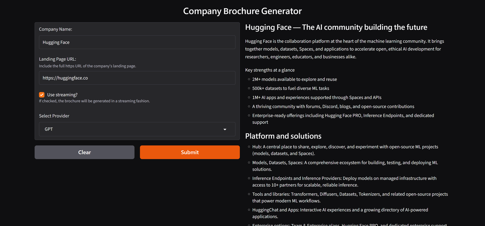
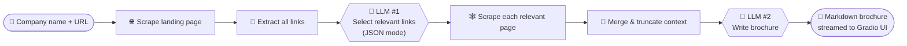

<div align="center">

# 🏢 Company Brief AI

### Turn any company website into a polished marketing brochure in seconds, powered by LLMs.

[](https://www.python.org/)
[](https://platform.openai.com/)
[](https://ai.google.dev/)
[](https://www.gradio.app/)
[](https://docs.astral.sh/uv/)

<br/>



<sub><i>Generating a live, streamed brochure for <b>Hugging Face</b> from just its name and URL.</i></sub>

</div>

---

## 📑 Table of Contents

- [Overview](#-overview)
- [Key Capabilities](#-key-capabilities)
- [How It Works](#-how-it-works)
- [Example Output](#-example-output)
- [Getting Started](#-getting-started)
- [Configuration](#%EF%B8%8F-configuration)
- [Usage](#%EF%B8%8F-usage)
- [Project Structure](#-project-structure)
- [Tech Stack](#%EF%B8%8F-tech-stack)
- [Roadmap](#%EF%B8%8F-roadmap)

---

## 🔭 Overview

**Company Brief AI** is a multi-step AI pipeline that researches a company the way a human would. It opens the homepage, decides which pages are worth reading, reads them, and then writes a concise summary.

Give it a **company name** and a **landing-page URL**, and you get a well-structured **Markdown brochure** for three audiences:

| 🛒 Prospective Customers | 💰 Investors | 👩‍💻 Recruits |
| :---: | :---: | :---: |
| Products, solutions & value proposition | Scale, traction & market position | Culture, values & open careers |

---

## ✨ Key Capabilities

<table>
<tr>
<td width="50%" valign="top">

### 🧭 Agentic Link Selection
The LLM reviews **every link** on the landing page and returns only the relevant ones, such as About, Company, Careers, and Customers, as **structured JSON**. Noise like Terms of Service, Privacy, and `mailto:` links is filtered out.

</td>
<td width="50%" valign="top">

### 🕸️ Multi-Page Web Scraping
Fetches the landing page **plus every selected sub-page**, removes `<script>`, `<style>`, ``, and `<input>` tags, and keeps only clean, readable text.

</td>
</tr>
<tr>
<td width="50%" valign="top">

### 📝 AI Brochure Writing
Combines everything into a single context and writes a short brochure covering **overview, products, culture, customers, and careers**, in clean Markdown.

</td>
<td width="50%" valign="top">

### ⚡ Real-Time Streaming
Turn on **"Use streaming?"** to watch the brochure appear token by token, or turn it off to get the full result at once.

</td>
</tr>
<tr>
<td width="50%" valign="top">

### 🔀 Multi-Provider LLMs
Switch between **OpenAI GPT** and **Google Gemini** from a dropdown. Both use the same OpenAI SDK, with Gemini running through its OpenAI-compatible endpoint.

</td>
<td width="50%" valign="top">

### 🛡️ Robust & Cost-Aware
Request **timeouts**, a browser-like **User-Agent**, **graceful skipping** of pages that fail to load, and a configurable **content cap** (`MAX_CONTENT_CHARS`) to keep token costs predictable.

</td>
</tr>
</table>

---

## 🧠 How It Works



| Step | Module | What happens |
| :---: | --- | --- |
| **1** | [`scraper.py`](scraper.py) | Downloads the landing page and extracts its clean text and all `<a href>` links. |
| **2** | [`website_content_collector.py`](website_content_collector.py) | Calls the LLM in **JSON response mode** to choose brochure-relevant links. |
| **3** | [`website_content_collector.py`](website_content_collector.py) | Resolves relative URLs, fetches each page, and builds one combined document. |
| **4** | [`main.py`](main.py) | Sends the context with a brochure system prompt to the chosen model and streams or returns the result. |

---

## 📸 Example Output

<details open>
<summary><b>🤗 Hugging Face</b> (excerpt)</summary>

<br/>

> ### Hugging Face — The AI community building the future
> Hugging Face is the collaboration platform at the heart of the machine learning community. It brings together models, datasets, Spaces, and applications to accelerate open, ethical AI development for researchers, engineers, educators, and businesses alike.
>
> **Key strengths at a glance**
> - 2M+ models available to explore and reuse
> - 500k+ datasets to fuel diverse ML tasks
> - 1M+ AI apps and experiences supported through Spaces and APIs
> - A thriving community with forums, Discord, blogs, and open source contributions
> - Enterprise-ready offerings including Hugging Face PRO, Inference Endpoints, and dedicated support
>
> ### Platform and solutions
> - **Hub:** A central place to share, explore, discover, and experiment with open-source ML projects.
> - **Inference Endpoints and Inference Providers:** Deploy models on managed infrastructure with access to 10+ partners.
> - **Tools and libraries:** Transformers, Diffusers, Datasets, Tokenizers, and more.

📄 Full brochure: [`brochures/hugging_face_brochure.md`](brochures/hugging_face_brochure.md)

</details>

<details>
<summary><b>🏢 Akvelon</b></summary>

<br/>

📄 Full brochure: [`brochures/akvelon_brochure.md`](brochures/akvelon_brochure.md)

</details>

---

## 🚀 Getting Started

### Prerequisites

- 🐍 **Python 3.12+**
- 📦 [**uv**](https://docs.astral.sh/uv/) (recommended) or pip
- 🔑 An **OpenAI** API key and/or a **Google Gemini** API key

### 1️⃣ Clone the repository

```bash
git clone https://github.com/ahmedeldamaty20/Company-Brief-AI.git
cd Company-Brief-AI
```

### 2️⃣ Install dependencies

```bash
uv sync
```

<details>
<summary>Prefer pip?</summary>

```bash
python -m venv .venv
.venv\Scripts\activate          # Windows
# source .venv/bin/activate     # macOS / Linux
pip install beautifulsoup4 gradio openai python-dotenv requests
```

</details>

### 3️⃣ Add your API keys

Create a `.env` file in the project root (see [Configuration](#%EF%B8%8F-configuration)).

### 4️⃣ Launch

```bash
uv run main.py
```

Open the URL that Gradio prints, usually 👉 **http://127.0.0.1:7860**.

---

## ⚙️ Configuration

```env
# ── OpenAI ─────────────────────────────────────────
OPENAI_API_KEY=sk-proj-...
OPENAI_MODEL=gpt-5-nano

# ── Google Gemini (OpenAI-compatible endpoint) ─────
GEMINI_API_KEY=AIza...
GEMINI_URL=https://generativelanguage.googleapis.com/v1beta/openai/
GEMINI_MODEL=gemini-3.1-flash-lite

# ── Optional ───────────────────────────────────────
MAX_CONTENT_CHARS=20000
OUTPUT_DIR=brochures
```

| Variable | Description | Default |
| --- | --- | --- |
| `OPENAI_API_KEY` | OpenAI API key | — |
| `OPENAI_MODEL` | OpenAI model for link selection & writing | `gpt-5-nano` |
| `GEMINI_API_KEY` | Google Gemini API key | — |
| `GEMINI_URL` | Gemini OpenAI-compatible base URL | — |
| `GEMINI_MODEL` | Gemini model name | `gemini-3.1-flash-lite` |
| `MAX_CONTENT_CHARS` | Max scraped characters sent to the LLM | `20000` |
| `OUTPUT_DIR` | Folder for saved brochures | `brochures` |

> [!IMPORTANT]
> `.env` is listed in `.gitignore`, so never commit your API keys.

---

## 🕹️ Usage

| # | Field | Example |
| :---: | --- | --- |
| 1 | **Company Name** | `Hugging Face` |
| 2 | **Landing Page URL** | `https://huggingface.co` |
| 3 | **Use streaming?** | ✅ to watch it write live |
| 4 | **Select Provider** | `GPT` or `Gemini` |
| 5 | Click **Submit** | The brochure appears on the right ➡️ |

> [!TIP]
> Not sure where to start? Click one of the built-in **Examples** below the form to run a preset.

---

## 📁 Project Structure

```
company-brief-ai/
├── 📄 main.py                        # Gradio UI, prompts, provider routing & brochure generation
├── 📄 website_content_collector.py   # LLM-powered link selection + multi-page aggregation
├── 📄 scraper.py                     # HTML fetching, text cleaning & link extraction
├── 📂 brochures/                     # Sample generated brochures
│   ├── akvelon_brochure.md
│   └── hugging_face_brochure.md
├── 📂 assets/
│   └── screenshot.png                # UI screenshot used in this README
├── ⚙️ pyproject.toml                 # Project metadata & dependencies
├── 🔒 uv.lock
└── 🔑 .env                           # API keys & config (git-ignored)
```

---

## 🛠️ Tech Stack

| Layer | Technology |
| --- | --- |
| **Language** | Python 3.12 |
| **LLM SDK** | [OpenAI Python SDK](https://github.com/openai/openai-python) |
| **Models** | OpenAI GPT · Google Gemini |
| **Scraping** | Requests · BeautifulSoup4 |
| **UI** | [Gradio](https://www.gradio.app/) |
| **Config** | python-dotenv |
| **Packaging** | uv |

---

## 🗺️ Roadmap

- [x] Multi-page scraping with LLM-based link selection
- [x] OpenAI & Gemini support
- [x] Streaming responses in a Gradio UI
- [ ] One-click export to **PDF / HTML**
- [ ] Download button for the generated Markdown
- [ ] Caching of scraped pages
- [ ] Support for JavaScript-rendered sites (Playwright)
- [ ] More providers: Anthropic Claude, Ollama (local models)
- [ ] Multi-language brochures & tone selection (formal, playful, technical)

---

<div align="center">

**Built with ❤️ as part of an LLM Engineering journey**

⭐ If you find this project useful, consider giving it a star!

</div>
